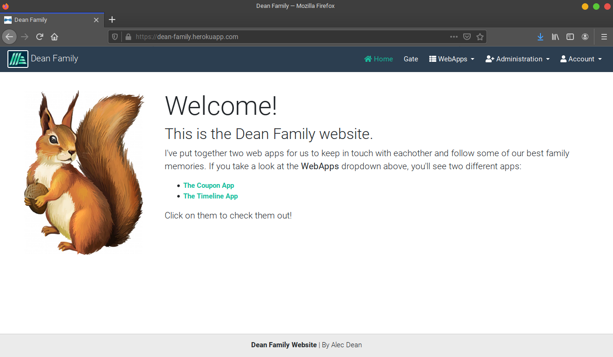

<!-- PROJECT LOGO -->
<br />
<p align="center">
  <a href="https://github.com/github_username/repo_name">
    
  </a>

  <h3 align="center">project_title</h3>

  <p align="center">
    project_description
    <br />
    <br />
    <a href="https://github.com/github_username/repo_name">View Site</a>
  </p>
</p>

- [About The Project](#about-the-project)
- [Technology Stack](#technology-stack)
  - [Frontend](#frontend)
  - [Backend](#backend)
- [Development](#development)
  - [Prerequisites](#prerequisites)
  - [Installation](#installation)
- [Usage](#usage)
- [Acknowledgements](#acknowledgements)
  <!-- ABOUT THE PROJECT -->

## About The Project



Jhipster is an open-source Yeoman generator that simplifies the creation of full stack web services and microservices. Since it is based on many industry standards for web development, I decided to experiment with it and make my own project in the hope of learning some of the best practices and tools for web development.

Go to [https://www.dean-family.herokuapp.com](http://www.dean-family.herokuapp.com) and log in with the following credentials:

- user name: user
- password: user

Once logged in, you'll find a home page with a **WebApps** pulldown in the navigation menu. Select either app to use it.

- **Coupon App**: I created this app to experiment with the SMTP mail service. It allows anyone to go in and send a request to my email account.
- **Timeline App**: This app uses JHipster's _Entity_ feature. I created a visualization to view all "Events" for my family to remember, whether it be vacations we took or excursions we've taken. I didn't fill it completely since it's a public site now.

This application was generated using JHipster 6.3.1, you can find documentation and help at [https://www.jhipster.tech/documentation-archive/v6.3.1](https://www.jhipster.tech/documentation-archive/v6.3.1).

## Technology Stack

When generating a JHipster project, there are many different cutting edge technology choices to select from. Below is a list of the technologies used for this specific project.

### Frontend

- Framework: Angular
- Build System: Webpack
- CSS Framework: Twitter Bootstrap

### Backend

- Framework: Sprint Boot 11
- Security Framework: Sprint Security
- Production Database: PostgreSQL
- Development Database: Liquibase
- Build System: Maven
- Deployment Framework: Heroku

<!-- GETTING STARTED -->

## Development

To get a local copy up and running follow these simple steps.

### Prerequisites

This is an example of how to list things you need to use the software and how to install them.

- npm
- Java 11
- docker-compose

### Installation

1. Clone the repo
   ```sh
   git clone https://github.com/github_username/repo_name.git
   ```
2. Install NPM packages
   ```sh
   npm install
   ```

<!-- USAGE EXAMPLES -->

## Usage

Run the following command to start the web service.

```
./mvnw
```

See the [JHipster Documentation](https://www.jhipster.tech/documentation-archive/v6.3.1) for more details.

## Acknowledgements

- [JHipster](https://www.jhipster.tech/)
